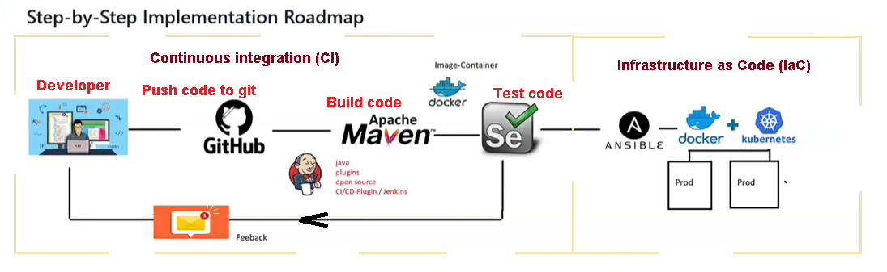
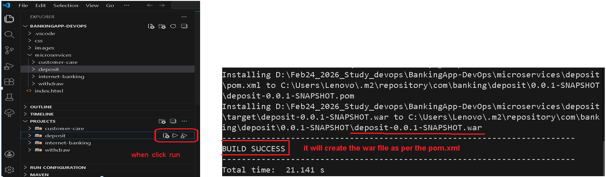
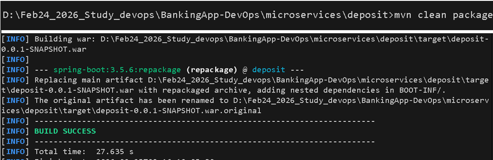
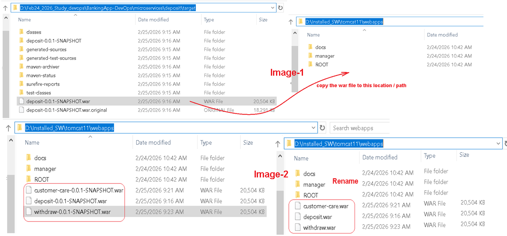
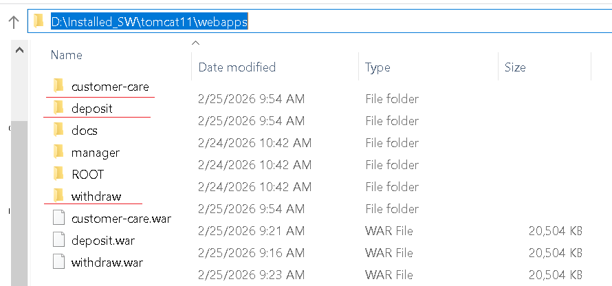
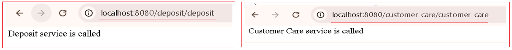
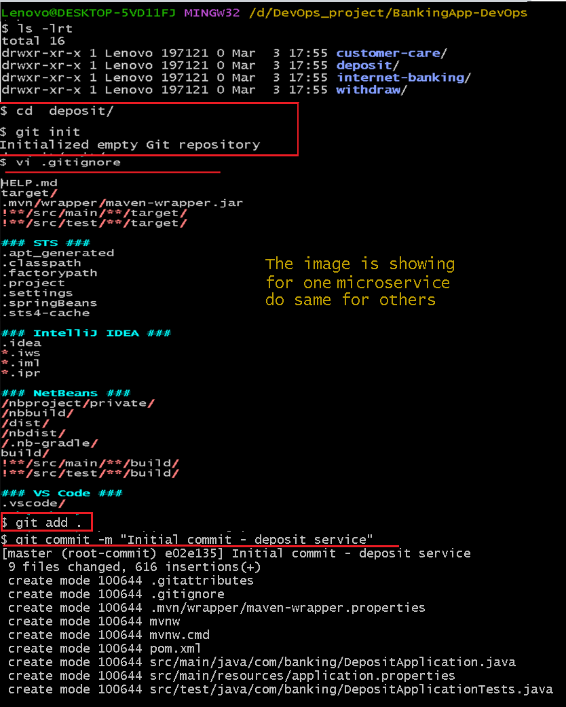
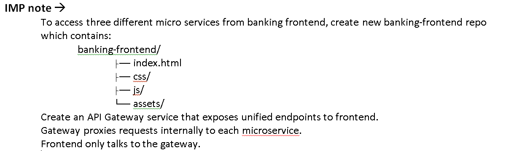
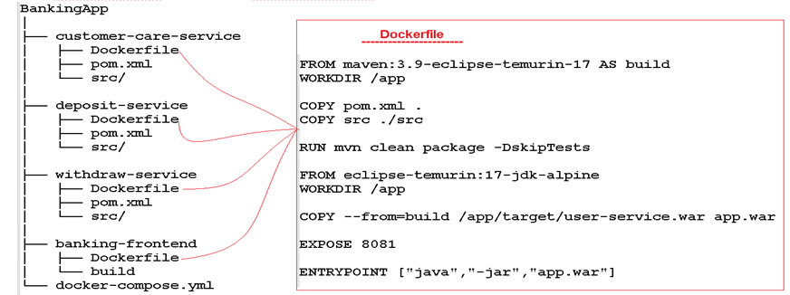

# Banking_EndtoEnd_Devops
This is a sample banking end to end project using jenkins, git , maven , docker , ansible , k8s , terraform 

# Learning Outcomes
Understand the microservices architecture
Learn how to automate builds, tests, and deployments using CI/CD
Gain experience with Docker, Kubernetes, Ansible, and Jenkins
Learn to integrate automated testing and monitoring in a DevOps pipeline
Understand real-world banking application deployment challenges
# Flow Diagram
 
# Project Flow
Developer commits code → triggers CI/CD pipeline
Maven builds & tests → Docker image built
Image pushed to registry
Selenium runs automated tests
Image pushed to registry → deployed to Kubernetes
Prometheus & Grafana monitor application health
Instructor verifies successful deployment & monitoring

# Required tools and packages in your system for testing 
Java source code url 
Java jdk17 or higher
Set java home 
Visual studio with java extension and Live Server
Tomcat11

# Manual test the Source code is OK
 

# How to test the code is running on Tomcat
Use the command   “ mvn  clean package ”   it will create the war file as mentioned in the pom.xml

 

Now copy the war files from the target directory and then paste it in  “ webapps ”  folder of tomcat
EX=>

Start tomcat service and open tomcat on http://localhost:8080/ 
Now we can see the packages has been extracted in Tomcat’s webapps folder.

Now we can access the modules / functionality from the url

# CI-CD STEPS
# =============================
# Phase 1: Project Setup & Source Code Management

• Initialize Git repository for each microservice.
 
 
• Create remote repository.

	git remote add origin https://github.com/<your-username>/deposit-service.git
    git branch -M main
    git push -u origin main
	
• Establish branching strategy (e.g., feature, develop, main).

	git checkout -b developer  #=========> Create developer branch
	git push -u origin developer
	
• Set up GitHub Actions/Jenkins webhook triggers for CI pipeline.

	Manage Jenkins → Manage Plugins  Install (Git plugin , GitHub plugin , Pipeline , GitHub Integration Plugin)
	Go to GitHub repository (deposit-service)  setting  webhooks  Add webhook 
		Payload URL  http://<your-jenkins-server>:8080/github-webhook/
		Content Type  application/json
		Events   Just the push event
	Click Add webhook
	Go to Jenkins Dashboard  Click New Item  Enter name   select Pipeline  OK
	Now Configure Pipeline Job  Add repo URL (https://github.com/<your-username>/deposit-service.git) 
	Under "Build Triggers"   GitHub hook trigger for GITScm polling 
Under "Pipeline"  Choose  Pipeline script from SCM   SCM  is Git   Repository URL (https://github.com/<your-username>/deposit-service.git) --> Branch is */developer  Script Path is Jenkinsfile

Note Jenkins file should be in your branch
git add Jenkinsfile
git commit -m "Add Jenkins pipeline"
git push origin developer

  
# Phase 2: Build Automation
• Configure Maven for automated build of Spring Boot applications.
    Use pom.xml to create build in maven
|Phase	|Command		|Purpose                                     |
|---------------|--------------------------------|-------------------|
|Validate|mvn validate	|Validate project structure                  |
|Compile	|mvn compile 	|Compile source code                     |
|Test	|mvn test		|Run unit tests                              |
|Package	|mvn package 	|Create JAR/WAR file                     |
|Verify	|mvn verify		|Run checks on package                       |
|Install	|mvn install 	|Install package to local repository     |
|Deploy	|mvn deploy		|Deploy to remote repository                 |
	
• Generate Dockerfiles for each microservice.
 
 Using this Dockerfile we can avoids committing .jar/.war files to any repository.
 The .war/.jar files are created automatically during the build process using Apache Maven or Gradle.
 It help to manage dependencies via tools (Maven/Gradle) instead of storing binaries in the repo.
 
# Phase 3: Containerization
• Create Docker images using Dockerfiles.

• Push images to a central repository (e.g., Docker Hub or GitHub Container Registry).

pipeline {
    agent any
	
	environment {
        DOCKER_HUB = "yourdockerhub"
        IMAGE_NAME = "deposit-service"
        IMAGE_TAG = "${BUILD_NUMBER}"
    }

    tools {
        maven 'Maven-3.9'
        jdk 'JDK-17'
    }
    stages {
        stage('Checkout') {
            steps {
                checkout scm
            }
        }
        stage('Maven Build') {
            steps {
                sh 'mvn clean package -DskipTests'
            }
        }
        stage('Docker Build') {
            steps {
                sh 'docker build -t $DOCKER_HUB/$IMAGE_NAME:$IMAGE_TAG .'
            }
        }
        stage('Docker Login') {
            steps {
                withCredentials([usernamePassword(credentialsId: 'dockerhub-creds',
                        usernameVariable: 'USERNAME',
                        passwordVariable: 'PASSWORD')]) {
                    sh 'echo $PASSWORD | docker login -u $USERNAME --password-stdin'
                }
            }
        }
        stage('Push Image') {
            steps {
                sh 'docker push $DOCKER_HUB/$IMAGE_NAME:$IMAGE_TAG'
            }
        }
        stage('Deploy') {
            steps {
                sh """
                docker stop deposit-service || true
                docker rm deposit-service || true
                docker run -d -p 8081:8081 \
                --name deposit-service \
                $DOCKER_HUB/$IMAGE_NAME:$IMAGE_TAG
                """
            }
        }
    }
}

# Phase 4: Infrastructure Automation
• Use Ansible to:
  - Install Docker, Kubernetes, and dependencies on servers.
  - Configure nodes, clusters, and load balancers automatically.
  - Manage environment variables consistently.

# Phase 5: CI/CD Pipeline Setup
• Configure Jenkinsfile or GitHub Actions Workflow:
i. Checkout Code
ii. Build with Maven
iii. Run Unit Tests
iv. Build Docker Image
v. Push Image to Registry
vi. Deploy to Kubernetes Cluster
vii. Run Selenium Integration Tests
viii. Promote build to next environment (UAT → Production)

# Phase 6: Testing Automation
• Use Selenium to test the integration between services.
• Trigger automated tests post-deployment in the CI/CD pipeline.

# Phase 7: Monitoring Setup
• Integrate Prometheus to scrape metrics from Spring Boot apps and Kubernetes.
• Create Grafana Dashboards for:
  - Application health
  - Pod status
  - API response times
  - Error rates

# Phase 8: Deployment Validation
• Test application consistency across all environments.
• Validate rollback and recovery processes.

# Expected Deliverables
1. Source Code Repositories – GitHub repositories for each microservice
2. Docker Images – Containerized versions of all services
3. Jenkins/GitHub Actions Pipelines – Fully automated CI/CD pipelines
4. Ansible Playbooks – Scripts to automate infrastructure and configuration setup
5. Selenium Test Scripts – Automated UI and integration test suite
6. Kubernetes Deployment Files – YAML manifests for pods, services, and ingress
7. Monitoring Dashboards – Prometheus + Grafana visualization setup

